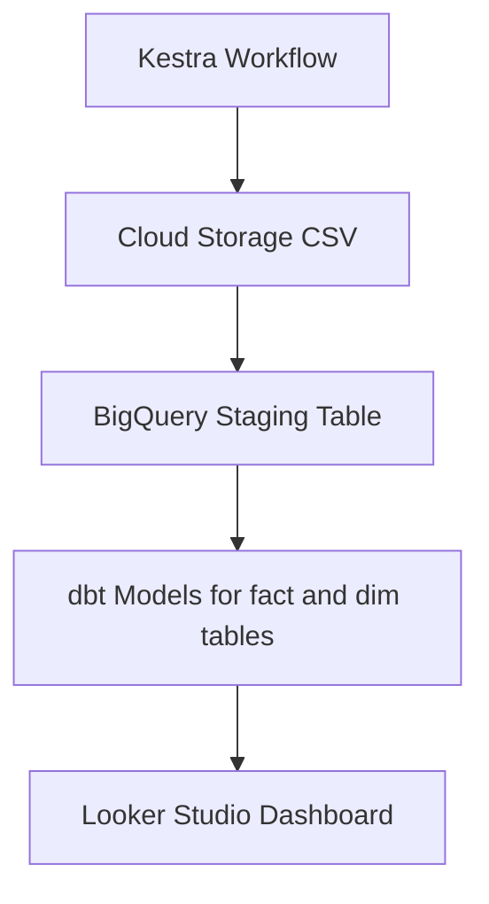

# 🌍 GDELT Batch Data Pipeline & Events Dashboard

[](https://www.getdbt.com/)  
[](https://cloud.google.com/)  
[](https://lookerstudio.google.com/s/pCBuHtd99RQ)

A scalable batch data pipeline to process **GDELT global events data**, using **BigQuery** as DWH, **Kestra** for workflow orchestration, and **dbt** for transformation — topped with a real-time **Looker Studio dashboard**.

---

## 🛠️ Tech Stack

| Tool         | Purpose                      |
|--------------|------------------------------|
| **Kestra**   | Workflow orchestration       |
| **dbt**      | Data modeling & testing      |
| **GCS**      | Data lake                    |
| **BigQuery** | Data Warehouse               |
| **Terraform**| GCP infra provisioning       |
| **Looker Studio** | Interactive dashboard   |

---

## ⚙️ Architecture Overview



---

## 📦 DBT Models

- **`stg_export_newsdata`** – Staging table with cleaned source data
- **`event_codes_lookup`** – Dim table for Event codes and their descriptions, created via dbt seed
- **`fact_events`** – fact table of events joining staging table with dim lookup table
- **`events_analysis`** – Final aggregated facts with
  - `GLOBALEVENTID`, `Event_Date`, `EventCode_type`, `EventRootCode_type`,
  - `CountryCode`, `Source_Domain`,  `num_articles`, `num_sources`, `num_mentions`
  - `Average_tone`, `Avg_Goldstein_Stability`

---

## 📊 Insights Delivered

✅ Root Event Volume % and Country-wise Sentiment (by Date Range)  
✅ Number of Mentions of the Country by Root Event Types

---

## 🚀 Setup Instructions
```bash
# clone the repo `GD-ETL-FLOW-BATCH_DATA_PIPELINE`
gh repo clone khushal2911/GD-ETL-Flow-Batch_Data_Pipeline
```

```bash
# Provision GCS Buckets and BigQuery dataset using Terraform IaC
# GCP VM for kestra and its backend postgreSQL DB were provisioned manually

cd terraform
terraform init
terraform plan
terraform apply
```

## 🛰️ Running Kestra Flows on GCP VM

### Initial Setup

1. Start the Kestra server:
```bash
sudo docker compose up
```

2. Access the Kestra UI:
- Forward ports 8080 and 8081 to your local machine
- Open `localhost:8080/ui/` in your browser

### Configuring the Data Pipeline

#### 🔹 Configure and execute the `data_insert_to_BigQuery` Flow

1. Modify the cron trigger to your desired schedule (e.g., `"/15 * 15 * *"` for every 15 minutes on the 15th day)

2. Use the backfill feature to include your selected date range:
    - Set appropriate start and end timestamps
    - Execute the backfill

    This flow will:
    - Extract CSV files in the GCS bucket `newslakehouse-gdelt-bucket`
    - Insert the data into the BigQuery table `export_newsdata` in the `newslakehouse_dataset`

#### 🔹 Create DBT Models with 'dbt_bq_flow'

1. Execute the `dbt_bq_flow` to build data models described previously [DBT Models](#dbt-models).

## 🔗 **Live Dashboard:**

You are now ready to view the Events Dashboard on Looker Studio, which updates real-time with the changes in underlying dataset. Here is the link.
👉 [Events Analysis Dashboard](https://lookerstudio.google.com/s/ipIOCCr7PV8)

## 📸 Screenshots
Visuals from the pipeline development and execution process:

🔹backfill_flow_execution_kestra.jpeg  
Demonstrates a manual backfill run in Kestra to ingest 96 files of GDELT export data corresponding to one day.

🔹kestra dashboard - newslakehouse.png  
Overview of the Kestra dashboard showing workflows, execution logs, and flow activity for the newslakehouse project.

🔹dbt_model_deploy_job_run.png  
Captures the successful execution of a dbt job triggered on dbt cloud, showing deployment status and run summary.

🔹kestra flow topology for dbt build.png  
Visual representation of the dbt_bq_flow topology, outlining task dependencies and execution order.

🔹kestra flow execution of dbt-build.png  
Real-time execution trace of the dbt build process within Kestra, displaying each task’s runtime.

🔹dbt model lineage.png  
Auto-generated lineage graph from dbt, showing relationships between source, staging, fact, dimension, and final models.

---
## 💡 Next Steps

🔹Add Spark Dataproc clusters for preprocessing before loading into BigQuery  
🔹Add real-time streaming with Kafka + Spark Streaming  
🔹Integrate CI/CD for Terraform and dbt runs  
🔹Determine Event Location accurately with better logic and use dim table for country code mapping.

## 🏆 Contributors
- **[Khushal_Kharade](https://github.com/khushal2911)** - Data Enthusiast

Feel free to fork and contribute! ✨
