# 🌍 GDELT Batch Data Pipeline & Events Dashboard

[](https://www.getdbt.com/)  
[](https://cloud.google.com/)  
[](https://lookerstudio.google.com/s/ipIOCCr7PV8)

A scalable batch data pipeline to process **GDELT global events data**, using **BigQuery** as DWH, **Kestra** for workflow orchestration, and **dbt** for transformation — topped with a real-time **Looker Studio dashboard**.

---

## 🛠️ Tech Stack

| Tool         | Purpose                      |
|--------------|------------------------------|
| **Kestra**   | Workflow orchestration       |
| **dbt**      | Data modeling & testing      |
| **GCS**      | Data lake                    |
| **BigQuery** | Data Warehouse               |
| **Terraform**| GCP infra provisioning       |
| **Looker Studio** | Interactive dashboard   |

---

## ⚙️ Architecture Overview

```mermaid
flowchart TD
    A[🛰️ Kestra Workflow Trigger] --> B[📂 GCS: Data Lake for CSV files ]
    B --> C[🧮 BigQuery: DWH Schema Generation and insertion - Staging Table ]
    C --> D[🔧 dbt: Fact & Dimension Models]
    D --> E[📊 Looker Studio: Interactive Dashboard]
```



---

## 📦 DBT Models

- **`stg_export_newsdata`** – Staging table with cleaned source data
- **`event_codes_lookup`** – Dim table for Event codes and their descriptions, created via dbt seed
- **`fact_events`** – fact table of events joining staging table with dim lookup table
- **`events_analysis`** – Final aggregated table with
  - `GLOBALEVENTID`, `Event_Date`, `EventCode_type`, `EventRootCode_type`,
  - `CountryCode`, `Source_Domain`,  `num_articles`, `num_sources`, `num_mentions`
  - `Average_tone`, `Avg_Goldstein_Stability`

---

## 📊 Insights Delivered

✅ Country-wise volume percentages of Root Event Types and their Sentiments derived using Average Tone  
✅ Number of Mentions of a Country by Root Event Types over a duration

---

## 🚀 GCP Setup Instructions

1. clone the project repository by running the following command
```bash
gh repo clone khushal2911/GD-ETL-Flow-Batch_Data_Pipeline
```  
2. Ensure to create the gcp service-account with roles such as BigQuery Admin, Storage Admin, and Compute Admin. Save credentials at ```../keys/gcp-sa-key.json"```  
3. Terraform IaC will setup the GCP resources such as  
  🔹project_id: `newslakehouse`,  
  🔹gcs buckets: `newslakehouse-gdelt-bucket`, and `kestra-storage-bucket`  
  🔹bq dataset: `newslakehouse_dataset`. 

```bash
cd terraform
terraform init
terraform plan
terraform apply
```
4. While, GCP Compute for kestra and its backend postgreSQL DB were provisioned manually following the instructions on kestra docs at https://kestra.io/docs/installation/gcp-vm#configure-gcs. This is done to setup the kestra backend storage outside the vm i.e. using Cloud SQL.

## 🛰️ Running Kestra Flows on GCP VM

### Initial Setup

1. Follow `kestra\setup.md` to connect to kestra VM and install docker on it. 
2. Modify `kestra_configuration` inside `docker-compose.yml` with postgreSQL internal IP on line 24, and the service-account key on line 41. Convert the key to single line json using below command
```bash
cat sa-key.json | jq '@json'
```

2. Start the Kestra server docker image:
```bash
sudo docker compose up
```

3. Access the Kestra UI:
  - Forward ports 8080 and 8081 in VS Code, and Open `localhost:8080/ui/` in the browser

### Configure and Run the Data Pipeline

#### 🔹 Configure and execute the `data_insert_to_BigQuery` Flow

1. Modify the cron trigger to the desired date schedule 
    - e.g. `"/15 * 15 * *"` to run every 15 minutes on the 15th day of every month

2. Use the backfill feature to include the trigger date:
    - Set appropriate start and end timestamps
    - Execute the backfill

    This flow will:
    - Extract CSV files in the GCS bucket `newslakehouse-gdelt-bucket`
    - Insert the data into the BigQuery table `export_newsdata` in the `newslakehouse_dataset`

#### 🔹 Create DBT Models with 'dbt_bq_flow'
1. Execute `dbt_bq_flow` to build data models described previously [DBT Models](#dbt-models).

## 🔗 **Live Dashboard:**

Get ready to view the Events Dashboard on Looker Studio, which updates on real-time with the changes in underlying dataset. Here is the link.
👉 [Events Analysis Dashboard](https://lookerstudio.google.com/s/ipIOCCr7PV8)

## 📸 Screenshots
Visuals from the pipeline development and execution process:

1. backfill_flow_execution_kestra.jpeg  
      - Demonstrates a manual backfill run in Kestra to ingest 96 files of GDELT export data corresponding to one day.  
2. kestra dashboard - newslakehouse.png  
      - Overview of the Kestra dashboard showing workflows, execution logs, and flow activity for the newslakehouse project.  
3. dbt_model_deploy_job_run.png  
      - Captures the successful execution of a dbt job triggered on dbt cloud, showing deployment status and run summary.  
4. kestra flow topology for dbt build.png  
      - Visual representation of the dbt_bq_flow topology, outlining task dependencies and execution order.  
5. kestra flow execution of dbt-build.png  
      - Real-time execution trace of the dbt build process within Kestra, displaying each task’s runtime.  
6. dbt model lineage.png  
      - Auto-generated lineage graph from dbt, showing relationships between source, staging, fact, dimension, and final models.

---
## 💡 Next Steps

🔹Add Spark Dataproc clusters for preprocessing before loading into BigQuery  
🔹Add real-time streaming with Kafka + Spark Streaming  
🔹Integrate CI/CD for Terraform and dbt runs  
🔹Determine Event Location accurately with better logic and use dim table for country code mapping.

## 🏆 Contributors
- **[Khushal_Kharade](https://github.com/khushal2911)** - Data Enthusiast

Feel free to fork and contribute! ✨
